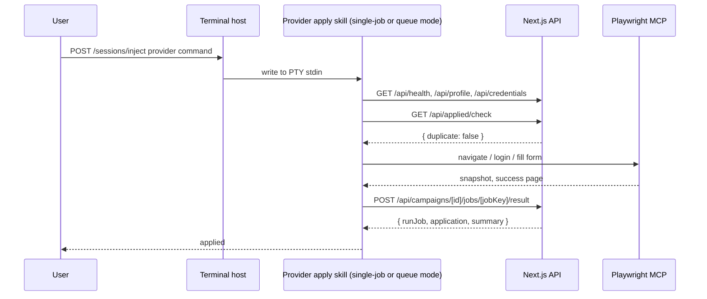

# Architecture

CareerPilot is a web app, a provider terminal host, and provider plugins glued
together over HTTP and a single active PTY.

## The Three Pieces

**Next.js + SQLite web app** ([src/web/](../src/web/)) is the data and UI
layer. It owns every persistent fact: profile, applications by stage,
autopilot campaigns with per-job status, and the batch URL queue. Prisma schema is
split per domain under `src/web/prisma/schema/`.

**Terminal host** ([src/terminal-node/](../src/terminal-node/)) is
a Node/TypeScript service on `127.0.0.1:8001`. It owns one active provider
PTY (node-pty in winpty mode) and bridges it to the web UI's xterm.js panel
over WebSocket. HTTP endpoints (`POST /sessions/start`, `POST /sessions/inject`,
`DELETE /sessions/current`, `GET /healthz`, `GET /ws`) let UI buttons write
provider-specific commands directly into the active provider's stdin. When
spawning a provider it also exports `CAREERPILOT_SKILLS_ROOT` and
`CAREERPILOT_WORKSPACE_ROOT` so wrappers can resolve shared skills without
filesystem inference.

**Plugin** ([plugin/](../plugin/)) is one provider-neutral plugin loaded by
both providers — there is no generation step. It holds:

- `plugin/skills/<name>/SKILL.md` — one directory per workflow; shared imports
  live under `plugin/skills/shared/*.md`. Skills reference sibling skills by
  name (e.g. "the `tailor-resume` skill") and shared docs by repo-relative path
  (`plugin/skills/shared/<doc>.md`), so the same text works for both providers.
- `plugin/.mcp.json` — the Playwright MCP server.
- `plugin/.claude-plugin/plugin.json` and `plugin/.codex-plugin/plugin.json` —
  the per-provider manifests (both name the plugin `careerpilot`). Codex's loader
  ignores unknown frontmatter keys, so Claude-only fields like `allowed-tools`
  stay in the single tree without breaking Codex.

Terminal starts Claude Code with `--plugin-dir plugin`, or Codex with
`codex --no-alt-screen -C <repo>`. Codex has no `--plugin-dir` flag; it
auto-discovers
[.agents/plugins/marketplace.json](../.agents/plugins/marketplace.json) from
the working directory, which points at `./plugin` (a local plugin source must
be a subdirectory — Codex rejects the repo root itself, which is why the
manifests live in `plugin/` rather than at the repo root). On first launch a
user enables the plugin from the `/plugin` menu. Developers can also run
providers directly:

```bash
claude --plugin-dir plugin
codex --no-alt-screen -C .
```

## Topology

```text
Browser (xterm.js)  <-- WS binary -->  Terminal host :8001      <-- PTY -->  claude --plugin-dir plugin
                    -- POST /inject -> Terminal host                       or codex --no-alt-screen -C <repo>
Next.js :8000 API   <-- curl -------- CareerPilot skills
                                      -> insert/update campaigns/jobs in SQLite
```

One Terminal instance owns one PTY. The PTY survives browser tab close;
reopening the terminal panel attaches a new WebSocket to the same live session.
Switching providers stops the current PTY and starts the selected provider.
There is no replay buffer, so use the active provider's terminal scrollback for
history.

## Plugin Layout

```text
plugin/                                    # the plugin (edit these)
|-- .claude-plugin/plugin.json             # Claude manifest
|-- .codex-plugin/plugin.json              # Codex manifest
|-- .mcp.json                              # Playwright MCP
`-- skills/
    |-- shared/                            # setup, auth, form-filling, browser-tips
    `-- <name>/SKILL.md                    # one directory per workflow

.agents/plugins/marketplace.json           # points Codex at ./plugin
```

The web app formats injected commands as `/careerpilot:<skill>` for Claude
(plugin namespace) and `$<skill>` for Codex (bare; the Codex plugin owns the
namespace by virtue of being the only installed plugin in this workspace).

Root `.claude/settings.json` grants the project permissions needed by the
skills. The plugin owns reusable behavior; the repository owns local trust and
permission policy.

## Request Lifecycle: A Single Apply Campaign



## Live Runs

Autopilot and apply create and update campaign rows through `/api/campaigns/*`.
The web UI opens `EventSource /api/campaigns/[id]/events`, receives in-process SSE
events, and invalidates the campaign detail query so the page refetches canonical
state from SQLite.

## Skills Layer

`plugin/skills/shared/setup.md` is the single source of truth for
loading config. Every skill hits `/api/health`, then
`GET /api/profile`, then `GET /api/credentials`. Resume access goes through
`data.defaultResumeAbsolutePath` from the profile endpoint, or
`GET /api/resumes/[id]/file` for a stream.

`auth.md`, `form-filling.md`, and `browser-tips.md` cover cross-cutting browser
behavior. `plugin/skills/humanizer/SKILL.md` is chained from the cover-letter
and upwork-proposal workflows by name — each instructs the provider to invoke
the `humanizer` skill.
